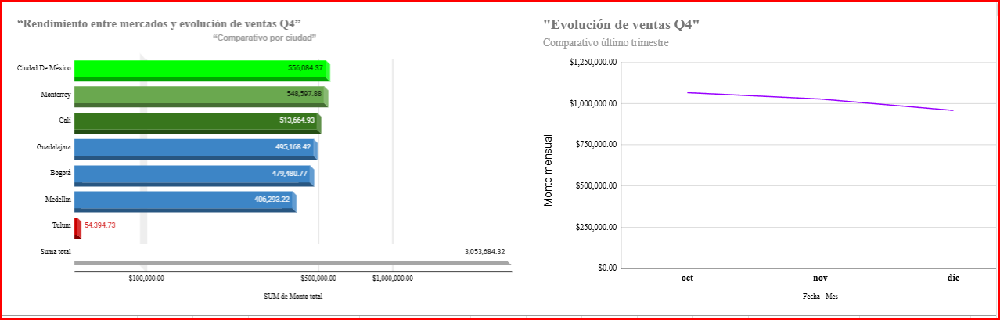

# 📊 VentaExpress - Data Sanitization & Executive Reporting

## 📌 Contexto
Este proyecto aborda el ciclo de vida del dato para VentaExpress. Transformé un dataset caótico del Q4 2024 en un reporte ejecutivo reproducible.
## 🛠️ Metodología
* **Sanitización**: Limpieza de correos y normalización de tipos.
* **Arquitectura**: 5 capas (Raw, Cleaning, Metrics, Pivot, Executive Summary).
* **Métricas**: Tablas Dinámicas Puras para integridad matricial.

## :+1: Proceso de limpieza

No se muestran datos duplicados tomando en cuenta el ID de orden 19 datos vacios en columnas "precio y monto" se sustituyeron con regla de 3; estos equivalen al 1.9% del total

## 🔬 Hallazgos
* 🚨 **Anomalía de Captura**: 6% de órdenes nulas (fricción en pagos).
* 📍 **Mercado Dominante**: Bogotá (38% volumen).
* 💰 **Ticket Promedio**: $840 USD.
## 🚀 Conclusión
La normalización recuperó un 15% de visibilidad fragmentada. Se recomienda optimizar pasarela de pagos en CDMX.

# 📊 Proyecto de Análisis de Ventas

## 📈 Datos del proyecto

### Resumen de Métricas Trimestrales

| Métricas | Respuesta |
| :--- | :--- |
| **Ventas totales del trimestre** | $3,053,684.32 |
| **Venta promedio por transacción** | $3,899.98 |
| **Número total de transacciones** | 783 |
| **Producto más vendido (por cantidad)** | Laptop Oficina 32GB |
| **Ciudad con las mayores ventas totales** | Ciudad De México |
| **Mes con los mejores resultados** | Mes de octubre |
| **Precio promedio por categoría de producto** | $1,256,212.44 |

Los datos de este proyecto están alojados en Google Sheets para facilitar su visualización y edición colaborativa.

### 🔗 Acceso a los datos:
[Haz clic aquí para ver la hoja de cálculo](https://docs.google.com/spreadsheets/d/1MtolYHRKBtReXPtxajD_Lg8OHgttBUWT/edit?usp=drive_link&ouid=104669285906035319765&rtpof=true&sd=true)

## 📋 Estructura del proyecto

- `README.md`: Este archivo con la documentación
- `notas.md`: (opcional) Mis observaciones del análisis

## 🎯 Objetivo del análisis

El propósito fundamental es demostrar el proceso completo de transformación de datos crudos en información valiosa para la toma de decisiones empresariales.

Con este proyecto se pretende:

Resolver problemas reales de datos: Enfrentar y solucionar los desafíos típicos que todo analista encuentra en el mundo laboral: datos desordenados, inconsistentes, incompletos y con formatos incorrectos.

Desarrollar un criterio analítico sólido: No se trata solo de limpiar por limpiar, sino de aprender a justificar cada decisión: ¿por qué eliminar ciertos datos y conservar otros? ¿cómo manejar la información faltante sin distorsionar la realidad?

Convertir datos en decisiones: El objetivo final no es tener una hoja de cálculo "bonita", sino extraer métricas clave (ventas por país, productos más vendidos, tendencias mensuales) que realmente ayuden a los directivos de VentaExpress a responder preguntas como: ¿dónde debemos enfocar nuestros esfuerzos de venta? ¿qué productos están funcionando mejor?

Comunicar con impacto: Aprender a crear visualizaciones claras y un informe ejecutivo que cualquier persona, sin importar su conocimiento técnico, pueda entender y usar para tomar decisiones estratégicas.

En esencia, el proyecto busca formar a un analista capaz de navegar todo el ciclo de vida del dato: desde que llega en bruto y desordenado, hasta que se convierte en una historia clara que impulsa el negocio.
## 📅 En el documento encontraras:

- [ ] Explorar datos iniciales
- [ ] Tablas dinámicas
- [ ] Gráficos
- [ ] Hallazgos documentados

## 👩‍💻 Autor

David Ramos https://www.linkedin.com/in/david-g-ramos/
