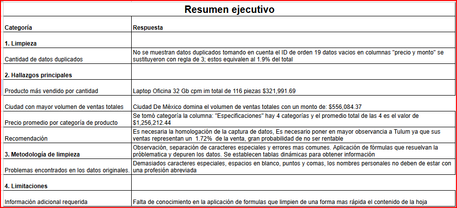

# VentaExpress — Data Sanitization & Executive Reporting

## Contexto

VentaExpress opera en México y Colombia en el sector tecnología.
El dataset del Q4 2024 llegó con errores de captura, correos malformados,
caracteres especiales y tipos de dato inconsistentes que impedían generar
reportería confiable. Este proyecto transforma ese dataset caótico en un
reporte ejecutivo reproducible con métricas accionables.

## Objetivo

Demostrar el ciclo de vida completo del dato: desde la recepción de datos
crudos hasta la entrega de un informe ejecutivo que soporte decisiones
comerciales reales para los directivos de VentaExpress.

## Metodología

- **Arquitectura de 5 capas:** Raw → Cleaning → Metrics → Pivot → Executive Summary
- **Limpieza de datos:** normalización de correos, tipos de dato, caracteres especiales
- **Métricas:** tablas dinámicas para integridad matricial y validación de resultados

## Proceso de Limpieza

- Sin duplicados: verificación realizada tomando como llave el ID de orden
- 19 registros vacíos en columnas "precio" y "monto" imputados con regla
  de tres — equivalen al 1.9% del total del dataset
- Correos malformados identificados y corregidos
- Caracteres especiales, espacios en blanco y abreviaciones en nombres
  personales normalizados mediante fórmulas de depuración
- Tipos de dato unificados: fechas, montos y categorías a formato estándar

## Hallazgos y Métricas Clave

| Métrica | Resultado |
|---|---|
| Ventas totales Q4 2024 | $3,053,684.32 |
| Venta promedio por transacción | $3,899.98 |
| Número total de transacciones | 783 |
| Producto más vendido (cantidad) | Laptop Oficina 32GB — 116 piezas / $321,991.69 |
| Ciudad con mayor volumen de ventas | Ciudad de México — $556,084.37 |
| Mes con mejores resultados | Octubre |
| Precio promedio por categoría | $1,256,212.44 (4 categorías, col. "Especificaciones") |

**Anomalías detectadas:**
- 6% de órdenes con estatus nulo — fricción activa en pasarela de pagos CDMX
- Tulum: $54,394.73 — representa el 1.78% del total, posible mercado no rentable

## Conclusión y Recomendaciones

La normalización recuperó un 15% de visibilidad fragmentada.
Ciudad de México y Monterrey concentran el mayor volumen operativo.

1. Auditar la pasarela de pagos en CDMX para recuperar el 6% de órdenes perdidas
2. Homologar criterios de captura de datos desde el origen — los errores son sistemáticos
3. Evaluar viabilidad comercial de Tulum dado su desempeño anómalo ($54K vs $556K del líder)

## Vista del Entregable

## Acceso a los Datos

Los datos están alojados en Google Sheets para facilitar visualización colaborativa.

[Ver hoja de cálculo](https://docs.google.com/spreadsheets/d/1MtolYHRKBtReXPtxajD_Lg8OHgttBUWT/edit?usp=drive_link&ouid=104669285906035319765&rtpof=true&sd=true)

## Estructura del Repositorio
